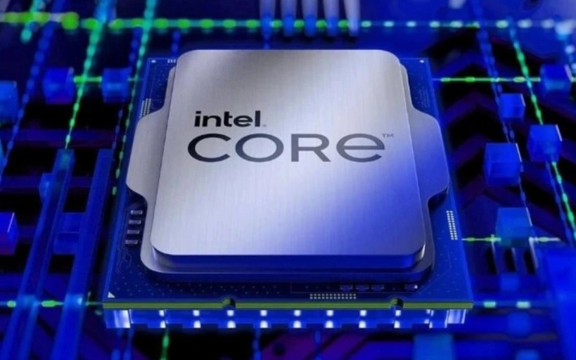
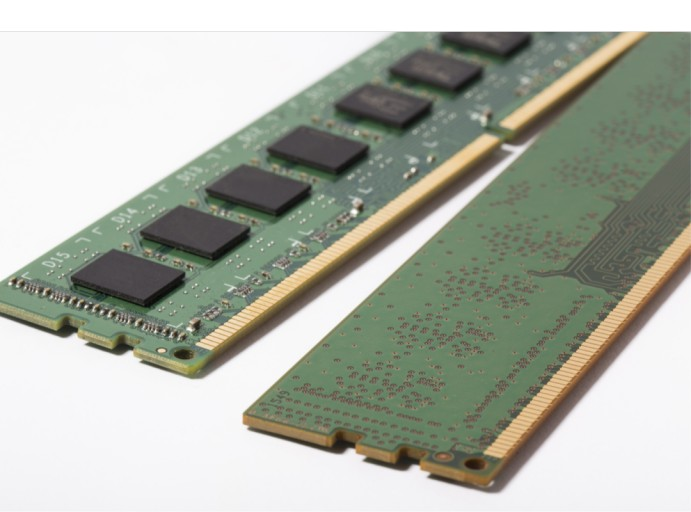
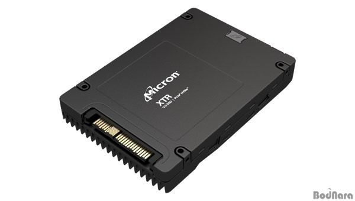
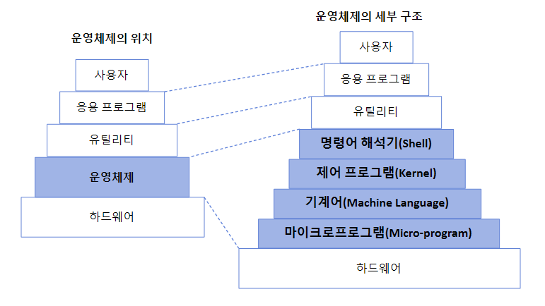
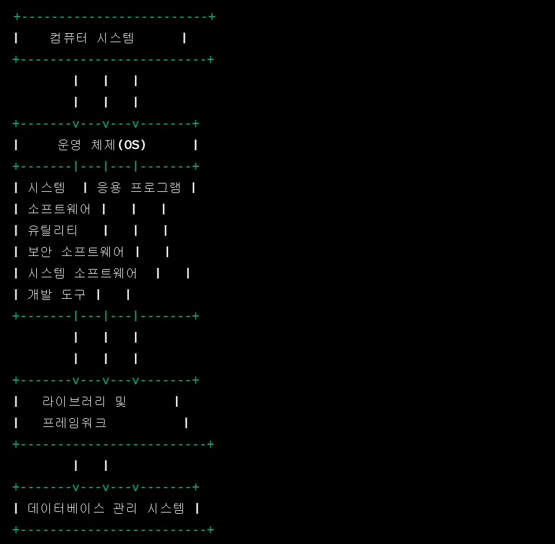

<h1> 컴퓨터의 구조 정리 </h1>

## 하드웨어

## CPU(중앙처리장치)
- 컴퓨터의 두뇌로 모든 계산 및 명령 처리를 담당
- 프로그램의 실행, 데이터의 처리, 연산 등의 작업을 수행
### 동작 원리
1. 명령 해석 : 메모리에 저장된 프로그램의 명령을 읽어 온다.  
              레지스터를 사용하여 실행할 명령의 주소를 추척한다.
2. 명령 해독 : 명령을 이해하고 해당하는 동작을 수행하기 위해 명령을 해독한다.  명령은 일반적으로 연산, 메모리 엑세스, 제어 명령 중 하나이다.
3. 실행 : 명령을 수행한다. 연산이 수행되며 결과가 레지스터 또는 메모리에 저장된다. cpu는 데이터와 레지스터 간의 논리 연산, 산술 연산, 비트 조작 등을 수행한다.
4. 결과 저장 : 실행 단계에서 생성된 결과를 적절한 위치(메모리)에 저장한다.
  저장함으로써 명령은 완료되고, 프로그램 카운터를 업데이트하여 다음 명령을 시행한다.

* 레지스터 : cpu 내부에 있는 작은 저장공간.
* 프로그램 카운터 : cpu 내부의 레지스터 중 하나. 
현재 실행 중인 프로그램에서 다음에 실행할 명령의 주소를 저장하는 역할

---

## RAM (메모리)

### 동작원리
1. 데이터 저장
2. 주소 지정 - cpu 또는 다른 하드웨어 장치는 ram에 저장된 데이터에 엑세스 하기 위해 데이터의 주소를 지정해야 함.
3. 랜덤 엑세스 - 동작 방식 : 임의의 주소에 저장된 데이터에 직접 엑세스 함. 주소가 주어지면 데이터에 빠르게 접근
4. 임시 저장 - 컴퓨터가 실행중인 프로그램, 운영 체제, 작업 데이터 및 중간 결과를 일시적으로 저장하는데 사용. 데이터가 ram에 저장되면 CPU가 더 빠르게 엑세스 할 수 있음
5. 삭제 가능 - 전원이 거지면 저장된 데이터가 손실됨.

### CPU와의 연결

1. 데이터 및 명령어 저장 - cpu에서 실행 중인 프로그램의 데이터와 명령어를 저장하는 장소.
CPU는 ram에서 데이터를 읽고 쓰는 작업을 수행하고, 프로그램이 실행될 때 필요한 정보를 램에서 가져와서 사용
2. 데이터 엑세스 속도 - 램의 속도는 CPU의 속도와 직접적인 관련. 빠른 ram은 cpu가 데이터를 효과적으로 읽고 쓸 수 있도록 도와줌. 대기 시간을 최소화하며, 이는 시스템의 전반적인 성능 향상에 기여함
3. ram용량 - ram의 양은 cpu가 처리할 수 있는 데이터 양에 직접적인 영향. 많은 램을 가지고 있는 시스템은 동시에 더 많은 프로그램을 실행하거나 큰 데이터를 처맇라 수 있음
5. 데이터 교환 - cpu는 명령어를 ram에서 가져와 실행하고 계산된 결과를 ram에 저장함

---

## SSD

-  ram이 데이터를 일시적으로 저장한다면 ssd는 영구 저장 장치.
- 데이터와 파일을 오랫동안 보관하며 컴퓨터의 전원이 꺼져도 데이터가 유지
- 운영 체제가 설치되어 전원이 켜질 때 운영 체제가 부팅되게 함.

## 소프트웨어

---

- 기계어 : 0과1로 표시, 실행할 명령, 데이터, 기억 장소의 주소 포함. 하드웨어를 직접 실행시킬 수 있는 형태로 구성
- 마이크로 프로그램 : 롬과 프롬에 영구히 기록되는 프로그램 보통 펌웨어라고 함
- 제어 프로그램 : 하드웨어를 제어하는 프로그램. 메모리,cpu,단말기,프린터 등 시스템의 자원 활용도를 높이기 위해 스케줄링과 자료 관리를 하는 핵심 요소
- 명령어 해석기 : 사용자의 명령을 입력받아 시스템의 기능을 수행하는 명령 해석기. 사용자와 시스템 간의 인터페이스를 담당하는 프로그램.

1. 운영 체제
- 컴퓨터 시스템의 핵심 소프트웨어
- 하드웨어와 응용 프로그램 간의 상호 작용을 관리
- 프로세스 관리, 파일 시스템, 메모리 관리, 장치 드라이버, 사용자 인터페이스 포함

2. 시스템 소프트웨어
- 운영 체제와 하드웨어 간의 통신을 중재하고 운영 체제를 지원하는 역할
- 운영 체제 커널, 라이브러리, 장치 드라이버 포함

3. 응용 프로그램
- 사용자의 다양한 작업 및 요구에 따라 설계된 소프트웨어
- 워드, 웹 브라우저, 그래픽 디자인, 게임 등등에 사용

4. 프레임워크와 라이브러리
- 개발자가 응용 프로그램을 구축하고 확장하는데 사용되는 도구 및 기능
- 일반적으로 코드를 재사용하고 개발 프로세스를 단순화 하는데 도움

5. 데이터베이스
- 데이터베이스를 관리하고 엑세스 하는데 사용

6. 개발 도구
- 개발자용 소프트웨어 도구. 개발 환경(IDE), 컴파일러, 디비거 및 버전 관리 도구 포함
- 응용 프로그램 및 소프트웨어를 개발하고 디버깅하는데 사용

---
### 시스템 소프트웨어

1. 컴파일러 = 고급 언어(C언어, 자바 등 대부분의 프로그래밍 언어들은 고급언어)로 작성된 원시 프로그램을 목적 프로그램(기계어)로 변환
< br>
2. 어셈블러 = 저급 언어로 작성된 원시 프로그램을 목적 프로그램으로 변환. 기계어를 사람이 이해하기 쉬운 기호와 1 : 1로 대응시켜 기호화한 프로그램 언어.